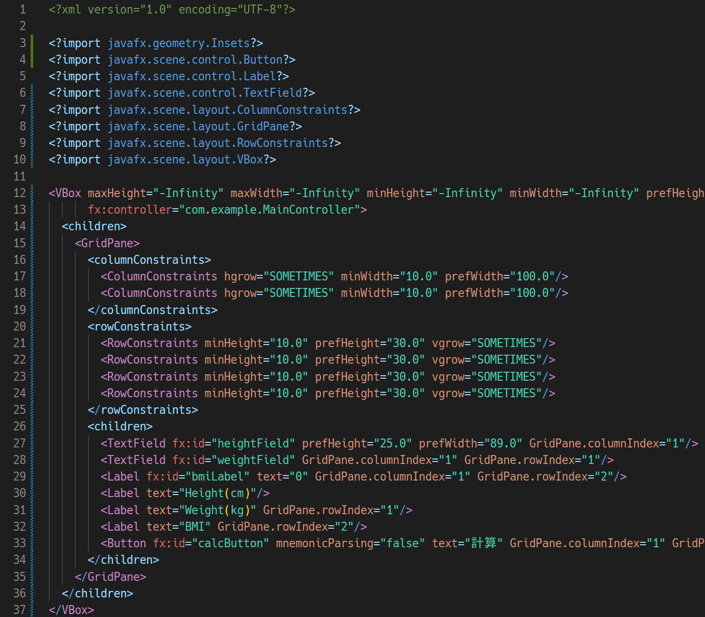
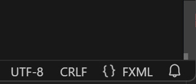
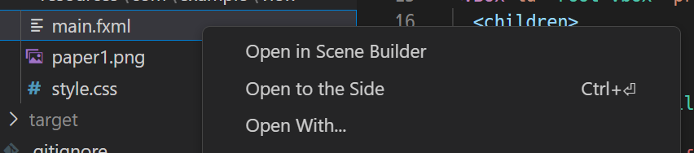
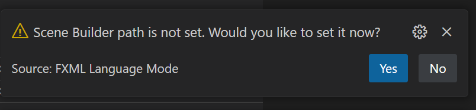
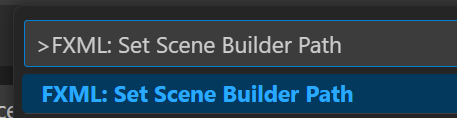

# FXML Language Mode

- Highlighter and Formatter for FXML (JavaFX)
- Open .fxml files in Scene Builder

## Highlighter

The FXML highlighter provides a more prominent color scheme than the default XML settings.

## Formatter

You can use an XML formatter specifically designed for FXML.

## FXML Language Mode

When you open a .fxml file, the editor automatically switches to FXML Language Mode.

## Open .fxml in Scene Builder 

To open .fxml file in Scene Builder, select 'Open in Scene Builder' from the context menu.

The default installation paths for Scene Builder are automatically detected:

- Windows:                
  - `%USERPROFILE%\scoop\apps\scene-builder\current\SceneBuilder.exe`
  - `%LOCALAPPDATA%\SceneBuilder\SceneBuilder.exe`
- macOS:
  - `/Applications/SceneBuilder.app`

If Scene Builder is not installed in the default path, you can manually select the installation path.

You can also select an installation path at any time from the command palette:

